# FUNC-001 設計図面: 楽曲評価と保存 (Rate & Save)

## 1. シーケンス図 (Sequence Diagrams)

### A. 楽曲評価フロー (Rate Song Flow)
ユーザーが星アイコンをクリックした際の処理フローです。 
**特徴:** 評価だけでなく、親データの作成、同アルバム内他曲の保存、Spotifyプレイリストへの追加といった「副作用」が発生する点が重要です。

### A-2. キーボードショートカット評価フロー (Keyboard Shortcut Rating Flow)
`Alt + 1〜5` によるキーボード評価の処理フローです。
**特徴:** キーリピート防止・処理中ロックによる連打防止ガードを経て、既存の評価API（セクションA）と同一フローに合流します。

#### ガード条件フローチャート

```mermaid
flowchart TD
    A["keydown イベント発火"] --> B{"e.target が INPUT / TEXTAREA / contentEditable?"}
    B -->|Yes| Z["無視 (return)"]
    B -->|No| C{"e.repeat === true?<br/>キー押しっぱなし"}
    C -->|Yes| Z
    C -->|No| D{"e.altKey === true?"}
    D -->|No| Z
    D -->|Yes| E{"e.key が 1〜5?"}
    E -->|No| Z
    E -->|Yes| F{"isProcessingRef === true?<br/>処理中ロック"}
    F -->|Yes| Z
    F -->|No| G["🔒 ロック取得<br/>isProcessingRef = true"]
    G --> H["handleRate&#40;ratingValue&#41; 実行"]
```

#### キーボード評価シーケンス図

```mermaid
sequenceDiagram
    autonumber
    actor User as User (Keyboard)
    participant UI as NowPlaying (React)
    participant Lock as isProcessingRef
    participant API as API (/api/player/like)
    participant Control as API (/api/player/control)

    User->>UI: Alt + 5 押下

    Note over UI: ガード条件チェック<br/>e.repeat / input focus

    UI->>Lock: ロック取得 (true)

    rect rgb(255, 250, 230)
        Note over UI: Optimistic UI
        UI->>UI: setRating(5)
        UI->>UI: Flash Effect (星拡大 300ms)
        UI->>UI: showToast("Rated 5 ★ — Skipping...")
    end

    UI->>API: POST /like (track, rating: 5)
    API-->>UI: { success: true }

    alt Auto-Next ON
        Note over UI: 500ms 待機
        UI->>Control: POST /control { action: "next" }
        Control-->>UI: Success
    end

    Note over UI: 処理完了後 500ms 遅延
    UI->>Lock: ロック解除 (false)

    Note over User: Alt + 5 連打しても<br/>ロック中は無視される
```

```mermaid
sequenceDiagram
    autonumber
    actor User as User (UI)
    participant API as API (/api/player/like)
    participant Spotify as Spotify API
    participant DB as Supabase (DB)

    User->>API: POST /like (track, rating: 5)
    
    %% 1. データ補完 (Data Enrichment)
    Note right of API: DB整合性のため<br>アルバム全曲を取得
    API->>Spotify: getAlbumTracks(album_id)
    Spotify-->>API: Tracks List

    %% 2. DB保存トランザクション的処理 (DB Persistence)
    rect rgb(240, 248, 255)
        Note right of API: 親データが存在しなければ作成
        
        par Parallel DB Operations
            API->>DB: UPSERT Artists (Artist Info)
            API->>DB: UPSERT Albums (Album Info)
        end
        
        API->>DB: UPSERT Songs (Target Song, Rate=5)
        Note right of DB: Returns status: 'added' or 'updated'
        
        API->>DB: UPSERT Songs (Other Tracks, Rate=0)
        Note right of API: 未評価曲として保存(検索用)

        API->>DB: Calculate & Update Album Score
    end

    %% 3. Spotify連携 (External Sync)
    alt New Rating (status == 'added')
        Note right of API: 新規評価時のみプレイリスト追加
        API->>Spotify: addTracksToPlaylist(playlist_id, uri)
        Spotify-->>API: Success
    else Updated Rating
        Note right of API: 既存更新ならスキップ
    end

    API-->>User: { success: true, sheet: 'added', spotify: 'added' }
    User->>User: Update UI (Star Icon, Toast)
```

### B. アルバム保存フロー (Save Album Flow)

```mermaid
sequenceDiagram
    autonumber
    actor User as User (UI)
    participant API as API (/api/player/save-album)
    participant Spotify as Spotify API
    participant DB as Supabase (DB)

    User->>API: POST /save-album (album_id)

    %% 1. 情報取得
    API->>Spotify: getAlbum(album_id)
    Spotify-->>API: Album Details

    %% 2. DB状態確認とトグル
    API->>DB: SELECT is_featured FROM albums
    
    alt Album Exists
        DB-->>API: { is_featured: true }
        Note right of API: Toggle to FALSE
    else New Album
        DB-->>API: null
        Note right of API: Set to TRUE (Default)
    end

    %% 3. 保存
    rect rgb(255, 240, 245)
        API->>DB: UPSERT artists
        API->>DB: UPSERT albums (is_featured: new_state)
    end

    API-->>User: { success: true, is_featured: new_state }
    User->>User: Update Heart Icon Color
```

## 2. 状態遷移図 (State Diagrams)

### 楽曲 (Song) の状態遷移

```mermaid
stateDiagram-v2
    [*] --> Unknown: Spotify上にはあるが<br>DBにはない

    Unknown --> Unrated: アルバム内の他の曲が評価された<br>(巻き込み保存)
    note right of Unrated
        rate: 0 / null
        is_saved: true
    end note

    Unknown --> Rated: 直接評価された
    Unrated --> Rated: 後から評価された
    
    state Rated {
        [*] --> HighRating: Rate 4-5
        [*] --> LowRating: Rate 1-3
        
        HighRating --> SpotifyPlaylist: 自動追加
    }
    note right of Rated
        rate: 1-5
        is_saved: true
    end note

    Rated --> Rated: 評価更新 (例: 3 -> 5)
```

### アルバム (Album) の状態遷移

```mermaid
stateDiagram-v2
    [*] --> New: 初回アクセス

    New --> Featured: ハートアイコンClick
    note right of Featured
        is_featured: true
        「特集」として表示
    end note

    Featured --> Normal: ハートアイコンClick (解除)
    note right of Normal
        is_featured: false
        DBには残るが特集ではない
    end note

    Normal --> Featured: 再度Click
```

